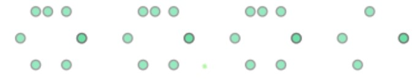

# simple-shapely-simplify-alternative (w.i.p.)

The `simplify()` method in shapely can be used to get rid of points that may be unncesesary for representing the object i.e. return a simplified version of the geometry object. See this [link](https://shapely.readthedocs.io/en/stable/manual.html#object.simplify) for further information on how the method works and is implemented. Sometimes it is unable to give an accurate 'simplified' representation that I was looking for and I've found myself in heuristic battles playing with the tolerance values and using the Douglas-Peucker algorithm flags to get the right result.

More specifically I may come across a polygon that is represented by more coordinates than necessary (but has the correct number of *vertices*). Typically we only need the vertices to represent a simple polygon but sometimes there will be points along, and collinear, with the edges between vertices and `simplify()` fails to remove them.

Here I look at a simple method that uses simple trigonometry to look at the interior angles to eliminate these points

here is a quick example:

 

randomly generated polygon with 6 vertices. Consider this the *goal* result.

now I'll add randomly generated points along the edges to emulate the types of problematic polygons mentioned earlier (here I have randomly generated 5 points per side to be collinear with the edges)

Below is an attempt using the  `simplify()` method with `preserve_topology = False` (which corersponds to using the [Douglas-Peucker algorithm](https://en.wikipedia.org/wiki/Ramer%E2%80%93Douglas%E2%80%93Peucker_algorithm))  and a range of tolerance values: `[1e-10, 0.1, 1, 10]` (left to right, respectively)

As you can see there is still a persistent 'non vertex' point in this example. And at some point (i.e. tolerance value of 10) the structure of the hexagon is lost.

Now if one runs the method of reducing points via interior angles as proposed..

as desired!

